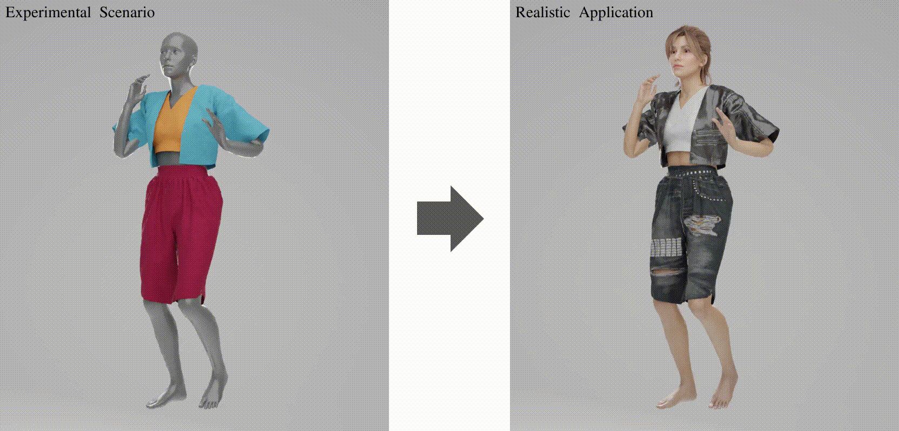

# Towards Multi-Layered 3D Garments Animation
\[[Paper](https://arxiv.org/abs/2305.10418)\] | \[[Project](https://mmlab-ntu.github.io/project/layersnet/index.html)\] | \[[Dataset](https://github.com/ftbabi/D-LAYERS_ICCV2023.git)\]

This is the official repository of "Towards Multi-Layered 3D Garments Animation, ICCV 2023".

**Authors**: Yidi Shao, [Chen Change Loy](https://www.mmlab-ntu.com/person/ccloy/),  and [Bo Dai](http://daibo.info/).

**Acknowedgement**: This study is supported under the RIE2020 Industry Alignment Fund Industry Collaboration Projects (IAF-ICP) Funding Initiative, as well as cash and in-kind contribution from the industry partner(s). It is also supported by Singapore MOE AcRF Tier 2 (MOE-T2EP20221-0011) and Shanghai AI Laboratory. 


**Feel free to ask questions. I am currently working on some other stuff but will try my best to reply. Please don't hesitate to star!** 

## News
- 4 Aug, 2023: Codes released

## Table of Content
1. [Video Demos](#video-demos)
2. [Dataset](#dataset)
3. [Code](#code)
4. [Citations](#citations)

## Video Demos


Please refer to our [project page](https://mmlab-ntu.github.io/project/layersnet/index.html) for more details.


## Dataset
Please follow [this repo](https://github.com/ftbabi/D-LAYERS_ICCV2023.git) to download and prepare the dataset.


## Code
Codes are tested on Ubuntu 18 and cuda 11.3.
We train our model with 4 V100.


### Installation
1. Create a conda environment with necessary packages
```
# PyTorch 1.10
conda create -n LayersNet python=3.8 pytorch=1.10 cudatoolkit=11.3 torchvision==0.11.0 torchaudio==0.10.0 -c pytorch -y
conda activate LayersNet

# mmcv-full
pip3 install openmim
mim install mmcv-full==1.6.1

# Other dependent packages
pip3 install h5py pyrender trimesh numpy==1.23.1 tqdm plotly scipy chumpy matplotlib
```
2. Clone and install this repo
```
git clone https://github.com/ftbabi/LayersNet_ICCV2023.git

cd LayersNet_ICCV2023
pip3 install -v -e .
```

### Dataset Preparation
1. Download [LAYERS](https://github.com/ftbabi/D-LAYERS_ICCV2023.git) and create a soft link to [LAYERS](https://github.com/ftbabi/D-LAYERS_ICCV2023.git) dataset.
```
ln -s PATH/TO/LAYERS/ data
```
2. To generate data for this repo, use the following commands
```
# Prepare the static information
python tools/preprocessing_data.py configs/layersnet/base/ep1.py --work_dir PATH/TO/LOG/DIR --dataset [train/val/test] --type static

# Prepare the dynamic information, e.g., velocity
python tools/preprocessing_data.py configs/layersnet/base/ep1.py --work_dir PATH/TO/LOG/DIR --dataset [train/val/test] --type dynamic
```

### Training
Train on multiple GPUs
```
sh tools/dist_seq.sh PATH/TO/CONFIG/DIR/ NUM_GPUS PATH/TO/WORK/DIR/ --seed 0
```

### Testing
1. Rollout the results of one sequence, e.g., sequence `00396` here:
```
python tools/test.py PATH/TO/CONFIG/FILE PATH/TO/CHECKPOINT --show-dir PATH/TO/SAVE/DIR/ --show-options rollout=396
```
2. Save quantitative results to a json file, e.g., `eval.json` here:
```
python tools/test.py PATH/TO/CONFIG/FILE PATH/TO/CHECKPOINT --out PATH/TO/SAVE/eval.json
```

### Visualization
To visualize the output, here take 10th frame from sequence `00396` as example, please use the following command
```
python tools/visualization.py PATH/TO/CONFIG/FILE PATH/TO/ROLLOUT/DIR/ --seq 396 --frame 10
```
Please note that the `PATH/TO/ROLLOUT/DIR/` should be the same as `PATH/TO/SAVE/DIR/` in [Testing Section](#testing).

## Citations
```
@inproceedings{shao2023layersnet,
  author = {Shao, Yidi and Loy, Chen Change and Dai, Bo},
  title = {Towards Multi-Layered {3D} Garments Animation},
  booktitle = {ICCV},
  year = {2023}
}
```
